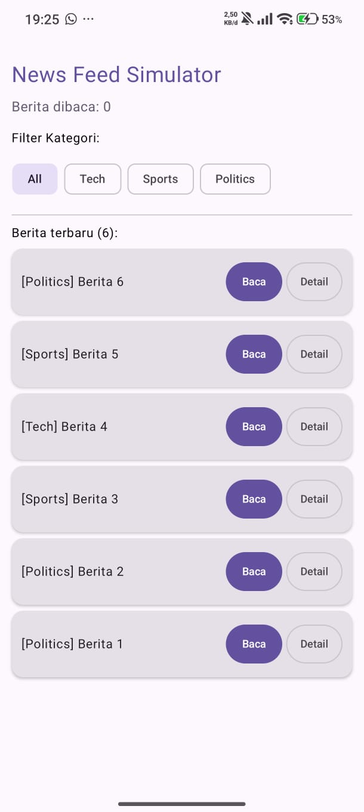
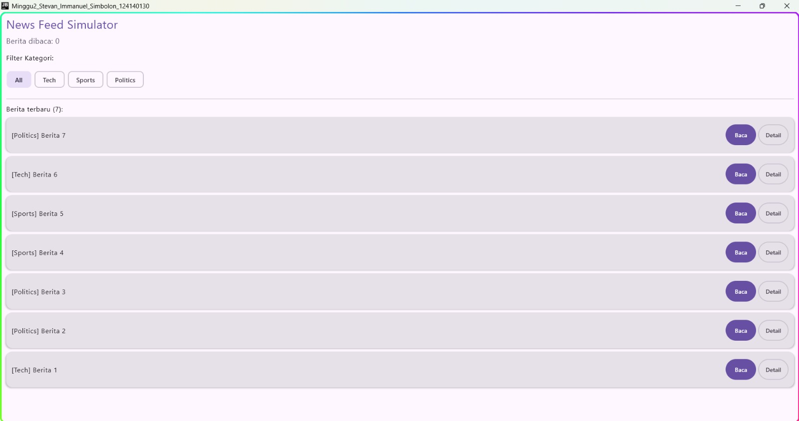

**Nama :** Stevan Immanuel Simbolon
**NIM  :** 124140130

Aplikasi "News Feed Simulator" menggunakan Kotlin Multiplatform (Compose) dengan fitur:

1. **Flow** yang mensimulasikan data berita baru setiap 2 detik.
2. **Filter** berita berdasarkan kategori tertentu.
3. **Transform** data menjadi format yang ditampilkan.
4. **StateFlow** untuk menyimpan jumlah berita yang sudah dibaca.
5. **Coroutines** untuk mengambil detail berita secara async.

### Cara Menjalankan

Gunakan run configurations di IDE (Android Studio / IntelliJ IDEA) atau jalankan perintah berikut di terminal:

- **Android** Dengan 2 cara berikut :
  1. Build APK: `./gradlew :androidApp:assembleDebug` (lalu install manual)
  2. Install via USB:
    1. Aktifkan **Developer Options** di HP Android (Tap Build Number 7x).
    2. Aktifkan **USB Debugging**.
    3. Sambungkan HP ke PC via kabel USB.
    4. Jalankan `./gradlew :androidApp:installDebug` di terminal, atau klik tombol segitiga (run) di Android Studio.
- **Desktop**:
  1. run dari terminal : `./gradlew :desktopApp:run`
  2. run dengan klik segitiga (run) di android studio

**Lampiran hasil run :**

*1. Android :*

*2. Dekstop :*

